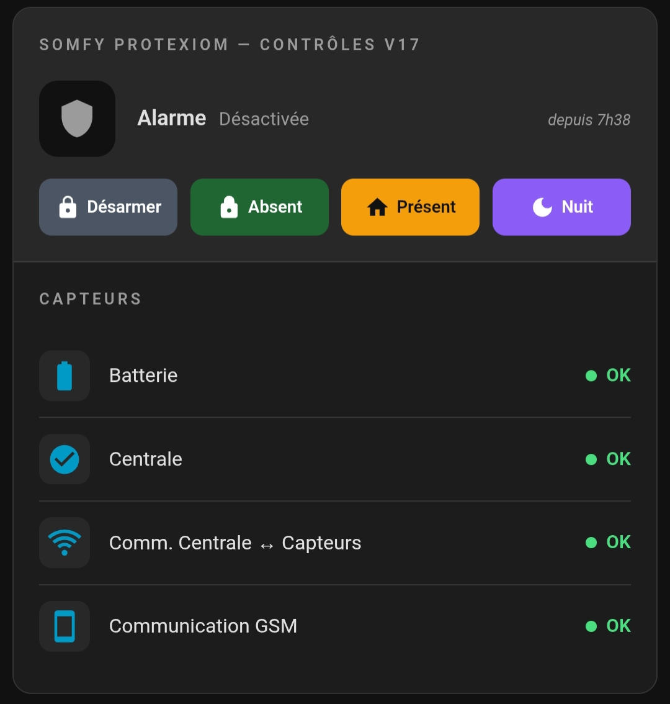

[![GitHub Release][releases-shield]][releases]
[](https://github.com/hacs/integration)
[![Community Forum][forum-shield]][forum]

# 🛡️ somfy-protexial-card

Carte personnalisée Home Assistant pour les centrales **Somfy Protexial / Protexiom / Protexial IO**.

Elle affiche en une seule carte l'état de l'alarme, les boutons de contrôle et l'état des capteurs fournis par l'intégration [somfy-protexial](https://github.com/the8tre/somfy-protexial) et son [fork](https://github.com/AuroreVgn/somfy-protexial) mis à jour avec les infos GSM .



---

## ✅ Prérequis

- Home Assistant avec l'intégration [somfy-protexial](https://github.com/the8tre/somfy-protexial) installée et configurée (sans les infos liées au GSM)

OU

- Home Assistant avec le [fork](https://github.com/AuroreVgn/somfy-protexial) mis à jour installé et configuréee (avec les infos liées au GSM)

Les entités suivantes doivent exister dans HA :

| Entité par défaut | Description |
|---|---|
| `alarm_control_panel.alarme` | Centrale d'alarme |
| `binary_sensor.somfy_protexial_batterie` | État des batteries |
| `binary_sensor.somfy_protexial_camera` | Caméra |
| `binary_sensor.somfy_protexial_centrale` | Centrale |
| `binary_sensor.somfy_protexial_comm_centrale_capteurs` | Communication Centrale ↔ Capteurs |
| `binary_sensor.somfy_protexial_communication_gsm` | Communication GSM |
| `binary_sensor.somfy_protexial_mouvement` | Détection de mouvement |
| `sensor.somfy_protexial_operateur_gsm` | Opérateur GSM - [fork](https://github.com/AuroreVgn/somfy-protexial) uniquement |
| `binary_sensor.somfy_protexial_portes_ou_fenetres` | Portes / Fenêtres |
| `sensor.somfy_protexial_signal_gsm_5` | Signal GSM - [fork](https://github.com/AuroreVgn/somfy-protexial) uniquement|

---

## 📥 Installation

### Via HACS (recommandé) 🔄
1. Ajoutez ce dépôt à HACS :
   **Dépôts personnalisés** → **Ajouter un dépôt personnalisé** → `https://github.com/developpeurbox/somfy-protexial-card/`

### Ou manuellement 🛠️

1. Télécharger le fichier `somfy-protexial-card.js`
2. Le copier dans le répertoire `/config/www/` de Home Assistant
3. Dans HA : **Paramètres → Tableaux de bord → Ressources → Ajouter une ressource**
   - URL : `/local/somfy-protexial-card.js`
   - Type : **Module JavaScript**
4. Vider le cache du navigateur ou de l'app Android (**Paramètres → Compagnon → Vider le cache**)

---

## 🎯 Utilisation

### Configuration minimale (YAML)

```yaml
type: custom:somfy-protexial-card
alarm_entity: alarm_control_panel.alarme
```

### Configuration complète (YAML)

```yaml
type: custom:somfy-protexial-card
alarm_entity: alarm_control_panel.alarme
title: "Somfy Protexial — Contrôle"
sensors:
  - capteur1
  - capteur2
  - capteur3
  - capteur4
  - capteur5
  - capteur6
  - capteur7
  - capteur8
  - capteur9
entities:
  capteur1: binary_sensor.somfy_protexial_batterie
  capteur7: sensor.somfy_protexial_operateur_gsm
labels:
  capteur1: "Batterie"
  capteur7: "Opérateur"
```

La carte dispose d'un **éditeur graphique intégré** : toutes les options sont configurables directement depuis l'interface HA sans éditer le YAML.

- La clé `sensors` liste les capteurs à afficher (tous activés par défaut).
- `entities` permet de remplacer une entité par défaut pour un capteur donné.
- `labels` permet de renommer l'étiquette affichée pour un capteur donné.

---

## ✨ Fonctionnalités

### 🔐 Section Alarme
- Affiche l'état courant de l'alarme avec couleur dynamique selon l'état
- Indique depuis combien de temps l'alarme est dans cet état (ex. *depuis 1h30*)
- Glow sur l'icône quand l'alarme est armée ou déclenchée
- 3 boutons d'action :

| Bouton | Action HA |
|--------|-----------|
| Désarmer | `alarm_disarm` |
| Absent | `alarm_arm_away` |
| Présent | `alarm_arm_home` |

### 📡 Section Capteurs
- Affiche jusqu'à 9 capteurs de statut avec indicateur coloré
- Capteurs de type **binary** (`OK` / autre valeur) :
  - 🟢 **OK** — état nominal
  - 🔴 **Valeur KO** — alerte (valeur brute affichée)
- Capteurs de type **info** (valeur texte) :
  - Affichage de la valeur brute de l'entité avec point coloré (couleur principale du thème)

### 🎨 Thème
- S'adapte automatiquement au thème HA (clair / sombre) via les variables CSS natives de Home Assistant

---

## 🚦 États de l'alarme

| État HA | Libellé affiché | Couleur |
|---------|----------------|---------|
| `disarmed` | Désactivée | Gris |
| `armed_away` | Armée (absent) | Vert |
| `armed_home` | Armée (présent) | Orange |
| `armed_night` | Armée (nuit) | Violet |
| `arming` | Armement… | Orange |
| `pending` | En attente… | Orange |
| `triggered` | DÉCLENCHÉE ! | Rouge |
| `unavailable` | Indisponible | Gris |

---

## 🔗 Intégration associée

Cette carte est conçue pour fonctionner avec :

SANS les informations relatives au GSM : 
👉 [the8tre/somfy-protexial](https://github.com/the8tre/somfy-protexial) — Intégration Home Assistant pour centrale SOMFY Protexial / Protexiom / Protexial IO

AVEC les informations relatives au GSM : 
👉 [AuroreVgn/somfy-protexial](https://github.com/AuroreVgn/somfy-protexial) — Fork mise à jour de l'intégration Home Assistant pour centrale SOMFY Protexial / Protexiom / Protexial IO


[releases-shield]: https://img.shields.io/github/v/release/developpeurbox/somfy-protexial-card?style=for-the-badge
[releases]: https://github.com/developpeurbox/somfy-protexial-card/releases
[hacs-badge]: https://img.shields.io/badge/HACS-Custom-41BDF5.svg?style=for-the-badge
[hacs]: https://github.com/hacs/integration
[forum-shield]: https://img.shields.io/badge/community-forum-brightgreen.svg?style=for-the-badge
[forum]: https://community.home-assistant.io/
